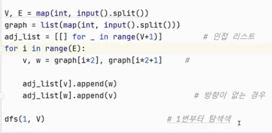

# 스택 기반 문제 해결 기법

- ## 재귀호출
  - 함수가 자신과 같은 작업을 반복해야 할 때, 자신을 다시 호출하는 구조
  
- ## Memoization
  - 컴퓨터 프로그램을 실행할 때 이전에 계산한 값을 메모리에 저장해서 매번 다시 계산하지 않도록 하여 전체적인 실행속도를 빠르게 하는 기술
  
- ## 동적계획법(DP, Dynamic Programming)
  - 입력 크기가 작은 부분 문제들을 먼저 해결한 뒤, 그 결과를 바탕으로 더 큰 부분 문제를 차례대로 해결해 나가며 최종적으로 전체 문제의 해답을 도출하는 알고리즘
  - 오버헤드: 추가적인 자원 소모나 처리 시간을 발생시키는 부가적인 비용
  
- ## 깊이 우선 탐색(DFS, Depth First Search)
  - 비선형 자료구조 탐색법: 깊이 우선 탐색(DFS), 너비 우선 탐색(BFS)
  - 한 방향으로 가능한 한 깊게 탐색한 후, 더 이상 갈 곳이 없으면 되돌아와 다른 방향을 탐색
  
